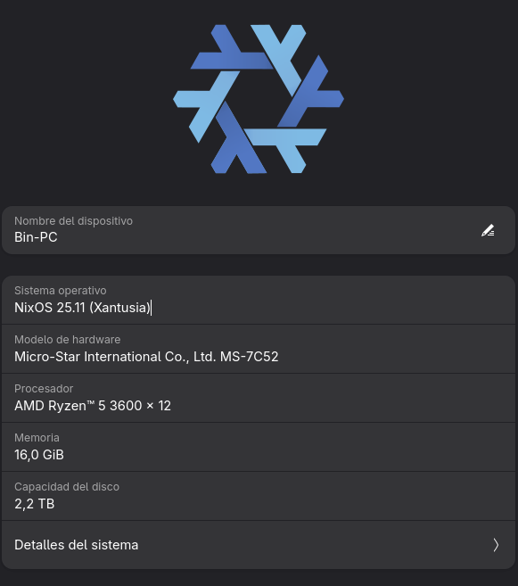
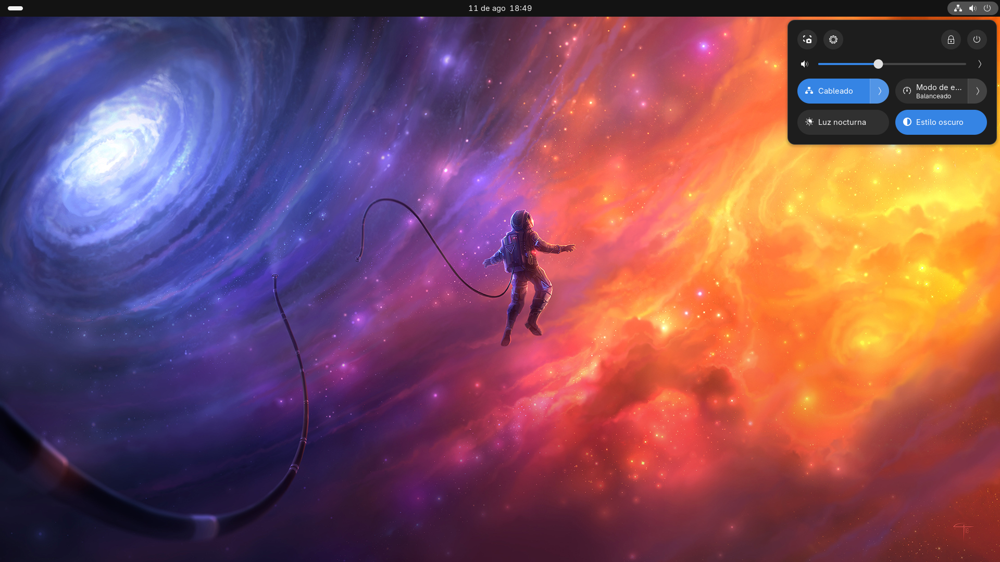
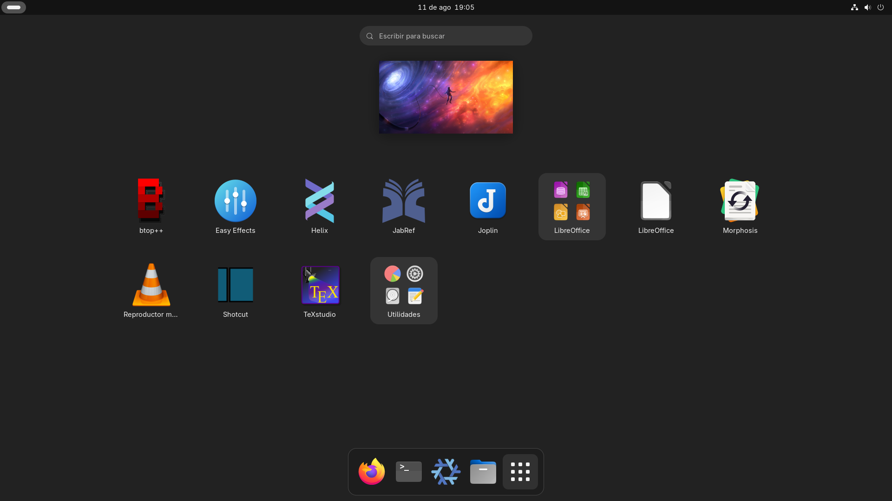
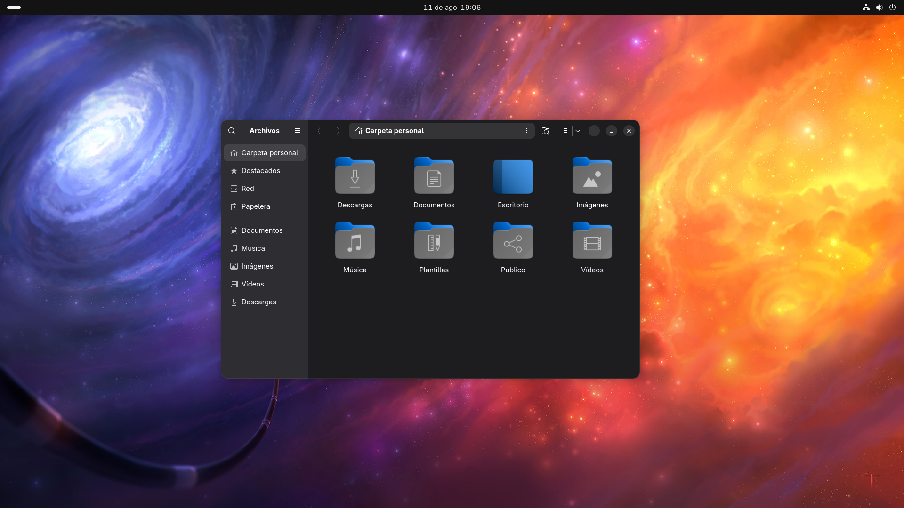

# NixOS - GNOME.
This is a simple NixOS configuration which have the apps and configurations I use almost every single day.

The idea behind this repository is share how I managed to declare all the environment. It's not recommended trying to duplicate the configuration, because every PC it's different.

I use four flakes: disko, home-manager, impermanence and sops-nix

# Screenshots.
Some screenshots are left here about the system specifications and how the desktop is seeing.

